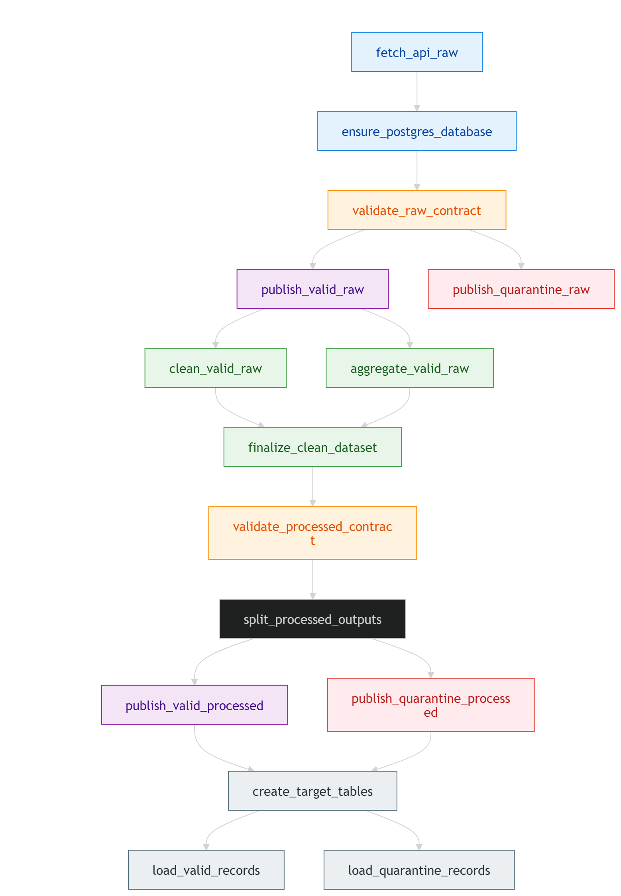

# Chicago Crimes Pipeline


Ce projet s'inscrit dans une demarche DataOps visant a industrialiser un pipeline de donnees automatise, robuste et reproductible. Il s'appuie sur Apache Airflow pour l'orchestration des workflows et sur Soda pour les controles de qualite, afin de mettre en place un flux fiable qui ingere les donnees, les valide, les transforme, effectue une seconde validation, puis les charge dans PostgreSQL.

L'objectif est de garantir l'automatisation, la fiabilite et la tracabilite du pipeline dans un contexte de deploiement local, cloud ou hybride, afin de reduire les erreurs manuelles, accelerer les livraisons et simplifier la maintenance.


## Lancement Airflow

```bash
astro dev start
```

Puis ouvrir Airflow sur `http://localhost:8080`.

Si tu modifies `requirements.txt` ou `Dockerfile`:

```bash
astro dev stop
astro dev start
```

## Lancement Streamlit avec Docker Compose

```bash
docker compose -f docker-compose.streamlit.yml up --build
```
## Lancement Streamlit en local (optionnel)

```bash
python3 -m venv .venv-streamlit
source .venv-streamlit/bin/activate
python -m pip install -r requirements-streamlit.txt
streamlit run streamlit_app.py
```

Commande pratique avec auto-detection du reseau Astro:

```bash
export ASTRO_AIRFLOW_NETWORK="$(docker inspect brief-4-prancing-architechture-pipeline-dataops_74776b-postgres-1 --format '{{range $k, $_ := .NetworkSettings.Networks}}{{$k}}{{end}}')"
docker compose -f docker-compose.streamlit.yml up --build
```

## Appel API et configuration Airflow

Le DAG `dag_main` recupere les donnees depuis l'API Socrata de Chicago via la connexion Airflow `chicago_crimes_api`.

Parametres utilises:
- connexion Airflow: `chicago_crimes_api`
- endpoint par defaut: `/resource/ijzp-q8t2.json`
- limite totale par defaut: `20000`
- taille de page de pagination dans le code: `1000`

Variables Airflow utilisees par `fetch_api_raw`:
- `CHICAGO_API_LIMIT`: nombre total maximal de lignes a recuperer
- `CHICAGO_API_ENDPOINT`: endpoint Socrata a appeler

Exemple d'appel effectue par le DAG:

```text
https://data.cityofchicago.org/resource/ijzp-q8t2.json?$limit=1000&$offset=0&$order=id ASC
```

Changer la limite de collecte:
1. Dans l'UI Airflow, aller dans `Admin > Variables`
2. Modifier `CHICAGO_API_LIMIT`
3. Relancer le DAG `dag_main`

Changer l'endpoint:
1. Dans l'UI Airflow, aller dans `Admin > Variables`
2. Modifier `CHICAGO_API_ENDPOINT`
3. Relancer le DAG `dag_main`

Configuration locale par defaut dans [airflow_settings.yaml](/home/dido/simplon_project/brief-4-prancing-architechture-pipeline-dataops/airflow_settings.yaml):
- `CHICAGO_API_LIMIT: 20000`
- `CHICAGO_API_ENDPOINT: /resource/ijzp-q8t2.json`

Si tu modifies [airflow_settings.yaml](/home/dido/simplon_project/brief-4-prancing-architechture-pipeline-dataops/airflow_settings.yaml), redemarre Astro pour reappliquer les variables et connexions:

```bash
astro dev stop
astro dev start
```

Point important:
- `CHICAGO_API_LIMIT` controle le volume total collecte
- `PAGE_SIZE=1000` est fixe dans [config.yml](/home/dido/simplon_project/brief-4-prancing-architechture-pipeline-dataops/dags/chicago_pipeline/config/config.yml) et controle la pagination
- pour changer `PAGE_SIZE`, il faut modifier le code puis redemarrer Airflow
- si tu augmentes fortement la limite, le temps d'execution, les CSV generes et la volumetrie PostgreSQL augmenteront aussi

## Architecture fonctionnelle

```text
Chicago Open Data API
        |
        v
Airflow / Astro
  DAGs:
  - dag_main
  - dag_main_poc
        |
        +--> Extract
        |     - extraction API
        |     - validation Soda raw
        |     - separation valid / quarantine
        |
        +--> Transformation
        |     - prepare
        |       - nettoyage
        |       - cast des types
        |       - dataset principal
        |     - aggregations
        |       - jeux agreges pour l'analyse
        |     - quality
        |       - validation Soda processed
        |     - outputs
        |       - split processed valid / quarantine
        |
        +--> Loading
              - init
              - records
                - load_valid_records
                - load_quarantine_records
              - aggregations
                - load_agg_*
        |
        v
PostgreSQL
  - chicago_crimes
  - chicago_crimes_quarantine
  - tables intermediaires de validation
        |
        v
Streamlit Dashboard
  - Overview
  - Quality Monitor
  - Data Health
  - Insights
```

## Architecture technique

Technologies utilisees:
- `Astro CLI` pour le runtime local Airflow
- `Airflow 3 / Astro Runtime` pour l'orchestration
- `Soda` et `soda-postgres` pour les validations de qualite
- `PostgreSQL` comme base locale de travail et de restitution
- `pandas` pour les transformations et les split valid/quarantine
- `Streamlit` pour le dashboard local
- `Docker Compose` pour lancer Streamlit separement d'Astro

Organisation du code Airflow:
- [dag_main.py](/home/dido/simplon_project/brief-4-prancing-architechture-pipeline-dataops/dags/dag_main.py): orchestration Airflow uniquement
- [config.yml](/home/dido/simplon_project/brief-4-prancing-architechture-pipeline-dataops/dags/chicago_pipeline/config/config.yml): constantes fonctionnelles, chemins et parametres du pipeline
- [config/__init__.py](/home/dido/simplon_project/brief-4-prancing-architechture-pipeline-dataops/dags/chicago_pipeline/config/__init__.py): chargeur Python de la configuration YAML
- [extraction.py](/home/dido/simplon_project/brief-4-prancing-architechture-pipeline-dataops/dags/chicago_pipeline/extraction.py): extraction API
- [quality.py](/home/dido/simplon_project/brief-4-prancing-architechture-pipeline-dataops/dags/chicago_pipeline/quality.py): controles Soda, rapports et quarantaine
- [transformation.py](/home/dido/simplon_project/brief-4-prancing-architechture-pipeline-dataops/dags/chicago_pipeline/transformation.py): nettoyage et agregations
- [loading.py](/home/dido/simplon_project/brief-4-prancing-architechture-pipeline-dataops/dags/chicago_pipeline/loading.py): chargement PostgreSQL
- [database.py](/home/dido/simplon_project/brief-4-prancing-architechture-pipeline-dataops/dags/chicago_pipeline/database.py): helpers de connexion et de remplacement de tables

## DAGs

Le projet contient actuellement deux DAGs:
- [dag_main.py](/home/dido/simplon_project/brief-4-prancing-architechture-pipeline-dataops/dags/dag_main.py)
- [dag_main_poc.py](/home/dido/simplon_project/brief-4-prancing-architechture-pipeline-dataops/dags/dag_main_poc.py)

Le DAG de reference pour le projet est `dag_main`.

`dag_main_poc` est conserve uniquement comme POC pour tester ou comparer certaines fonctionnalites du DAG. Il ne constitue pas le flux principal documente dans ce README.

Le DAG principal est volontairement leger: il contient surtout la declaration des `TaskGroup`, des `PythonOperator` et des dependances. La logique metier est externalisee dans le package [dags/chicago_pipeline](/home/dido/simplon_project/brief-4-prancing-architechture-pipeline-dataops/dags/chicago_pipeline).

Flux principal de `dag_main`:
1. `fetch_api_raw`
2. `ensure_postgres_database`
3. `validate_raw_contract`
4. `publish_valid_raw` et `publish_quarantine_raw`
5. `transformation.prepare`
6. `clean_valid_raw`
7. `finalize_clean_dataset`
8. `validate_processed_contract`
9. `split_processed_outputs`
10. `publish_valid_processed` et `publish_quarantine_processed`
11. `transformation.aggregations`
12. `aggregate_valid_raw`, `aggregate_hourly`, `aggregate_monthly`, `aggregate_serious_crimes`, `aggregate_community`, `aggregate_yearly`
13. `create_target_tables`
14. `loading.records`
15. `load_valid_records` et `load_quarantine_records`
16. `loading.aggregations`
17. `load_agg_hourly`, `load_agg_monthly`, `load_agg_serious`, `load_agg_community`, `load_agg_yearly`

TaskGroups visibles dans l'UI Airflow:
- `extract`
  - `source`
  - `quality`
  - `outputs`
- `transformation`
  - `prepare`
  - `aggregations`
  - `quality`
  - `outputs`
- `loading`
  - `init`
  - `records`
  - `aggregations`

Schema du flux:




## Contrats Soda

Configuration source locale:
- `include/soda/configuration.yml`

Contrats:
- `include/soda/contracts/raw_contract.yml`
- `include/soda/contracts/processed_contract.yml`

Role:
- `validate_raw_contract` controle le brut extrait
- `validate_processed_contract` controle le dataset final avant chargement
- les rapports sont ecrits sous `include/data/reports/`

## Regles de nettoyage

Le pipeline applique notamment:
- lecture du brut extrait depuis l'API Socrata
- pagination `limit / offset` dans [extraction.py](/home/dido/simplon_project/brief-4-prancing-architechture-pipeline-dataops/dags/chicago_pipeline/extraction.py)
- typage des colonnes numeriques et booleennes
- conversion de `date` et `updated_on` en `datetime`
- normalisation des noms de colonnes
- suppression des lignes sans `id`, `date` ou `primary_type`
- suppression des doublons restants sur `id`
- separation des lignes valides et des lignes en quarantaine

## Regles metier

Controles `raw`:
- `row_count > 1000`
- `id` obligatoire et unique
- `case_number` obligatoire et unique
- `date` obligatoire
- `primary_type` obligatoire
- `year >= 2001`
- `arrest` et `domestic` limites aux valeurs booleennes attendues

Controles `processed`:
- `row_count > 10000`
- `id` obligatoire et unique
- `case_number` obligatoire et unique
- `date` obligatoire
- `primary_type` obligatoire
- `year` obligatoire et `>= 2001`
- `arrest` obligatoire
- `domestic` obligatoire
- `latitude` entre `41.6` et `42.1`
- `longitude` entre `-88.0` et `-87.5`

## Base de donnees

Comportement actuel:
- la base `chicago_crimes` est creee seulement si elle n'existe pas
- les tables rechargees par le pipeline sont remplacees a chaque run
- le chargement n'est donc pas cumulatif dans l'etat actuel

Table finale valide:
- `public.chicago_crimes`

Table finale de quarantaine:
- `public.chicago_crimes_quarantine`

Tables intermediaires notables:
- `public.chicago_crimes_raw_contract`
- `public.chicago_crimes_raw_quarantine`
- `public.chicago_crimes_processed_contract`
- `public.chicago_crimes_processed_valid`
- `public.chicago_crimes_processed_quarantine`

## App Streamlit

Le dashboard local permet de consulter:
- une vue `Overview` avec statuts, ratios, funnel qualite et contexte technique
- une vue `Quality Monitor` pour lire les contrats Soda `raw` et `processed`
- une vue `Data Health` pour suivre la table valide et la quarantaine
- une vue `Insights` pour explorer les tables d'agregation avec des graphes simples

Structure:
- `streamlit_app.py`: point d'entree et navigation `st.navigation`
- `pages/0_Overview.py`
- `pages/1_Quality.py`
- `pages/2_Data_Health.py`
- `pages/3_Aggregations.py`

Modules internes:
- `streamlit_dashboard/config.py`
- `streamlit_dashboard/charts.py`
- `streamlit_dashboard/metrics.py`
- `streamlit_dashboard/services/reports.py`
- `streamlit_dashboard/services/postgres.py`
- `streamlit_dashboard/ui.py`

Fonctionnalites UX:
- bandeau de sante du pipeline
- cartes KPI
- visualisation de perte de volume
- repartition `raw` / `processed` sur la page qualite
- filtres et apercu de quarantaine dans `Data Health`
- bouton de rafraichissement
- navigation laterale simplifiee

Organisation des pages:
- `Overview`: contrats Soda, ratios de validite, tables finales, funnel qualite et contexte
- `Quality Monitor`: comparaison visuelle des controles `raw` et `processed`
- `Data Health`: suivi conjoint des tables `chicago_crimes` et `chicago_crimes_quarantine`
- `Insights`: visualisation des tables `agg_hourly`, `agg_monthly`, `agg_serious`, `agg_community`, `agg_yearly`

## Secrets locaux

Le fichier `include/soda/configuration.yml` doit etre cree localement.

Il est ignore par Git et contient les identifiants PostgreSQL.

Exemple minimal:

```yaml
type: postgres
name: chicago_crimes

connection:
  host: postgres
  port: 5432
  user: postgres
  password: postgres
  database: chicago_crimes
```
## Fichiers generes

Le pipeline ecrit localement:
- `include/data/raw/*.csv`
- `include/data/processed/*.csv`
- `include/data/quarantine/*.csv`
- `include/data/reports/*.csv`
- `include/data/reports/*.md`

Ces fichiers sont ignores par Git.

## Arborescence du projet

```text
.
├── dags/
│   ├── chicago_pipeline/
│   │   ├── __init__.py
│   │   ├── config/
│   │   │   ├── __init__.py
│   │   │   └── config.yml
│   │   ├── database.py
│   │   ├── extraction.py
│   │   ├── loading.py
│   │   ├── quality.py
│   │   └── transformation.py
│   ├── dag_main.py
│   └── dag_main_poc.py
├── include/
│   ├── data/
│   │   ├── raw/
│   │   ├── processed/
│   │   ├── quarantine/
│   │   └── reports/
│   ├── soda/
│   │   ├── configuration.yml
│   │   └── contracts/
│   │       ├── raw_contract.yml
│   │       └── processed_contract.yml
│   └── sql/
│       └── init_tables.sql
├── pages/
│   ├── 0_Overview.py
│   ├── 1_Quality.py
│   ├── 2_Data_Health.py
│   └── 3_Aggregations.py
├── streamlit_dashboard/
│   ├── __init__.py
│   ├── charts.py
│   ├── config.py
│   ├── metrics.py
│   ├── ui.py
│   └── services/
│       ├── __init__.py
│       ├── postgres.py
│       └── reports.py
├── streamlit_app.py
├── Dockerfile
├── Dockerfile.streamlit
├── docker-compose.streamlit.yml
├── airflow_settings.yaml
├── requirements.txt
├── requirements-streamlit.txt
└── README.md
```
